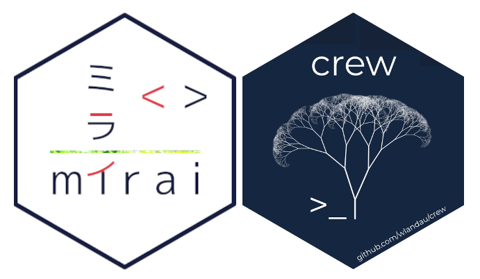

class: chapter-slide

# `mirai` and `crew` <br /> Powering the Next Generation of Parallel Computing in R

---
class: inverse, center, middle, chapter-slide

# [1] Introduction

---

## Re-encapsulating `mirai`

<center>

</center>

---

## Why `crew`?

<center>

</center>

<ul style="font-size: 30px">
  <li>Extends <code>mirai</code> to distributed computing environments.</li>
  <li>Centralized <code>R6</code> interface for tasks.</li>
  <li>Worker auto-scaling to respond fluctuating task loads.</li>
</ul>

---

## Moju Kapu in `crew`

.pull-left[

### Encapsulation

<center>

</center>

* Uses `mirai` developer interface: `daemon()`, `nextget()`, `saisei()` etc.
* `R6` class system for the controller interface.

]

.pull-right[

### Modularity

<center>

</center>

* Plugin system to launch parallel workers on different environments.
* Docs guide users to write their own plugins.
* Existing encapsulated plugins for SLURM, AWS Batch, etc.

]

---

## `R6` classes

| **Class** | **About** | 
|---|---|
| **Controller group** &nbsp;&nbsp;&nbsp;&nbsp;&nbsp;&nbsp;&nbsp;&nbsp;&nbsp;&nbsp;&nbsp;&nbsp;&nbsp;&nbsp;&nbsp; | Interface for many controllers. |
| **Controller** | Central task interface. |
| **Tasks** | List of `mirai` task objects. | 
| **Client** | `mirai` TCP connection hub. |
| **Relay** | Coordinate `mirai` synchronization primitives. |
| **Launcher** | Launches workers. Subclasses for plugins. |
| **Async** | Parallelize worker launches. |

---

## `R6` object composition

<center>

</center>

---

## `mirai` tasks, different interface

```{r, eval = FALSE}
# Start a controller.
library(crew)
controller <- crew_controller_local(
  workers = 2,
  seconds_idle = 10
)
controller$start()

# Submit tasks asynchronously.
controller$push(command = 1 + 1)
controller$push(command = sqrt(9))

# Wait for a task to finish.
controller$wait(mode = "one")

# Collect the result.
controller$pop()$result[[1]]
#> [1] 3
```

---

## Different plugin, different controller

```{r, eval = FALSE}
# Start an AWS Batch controller with many workers.
library(crew.aws.batch)
controller <- crew_controller_aws_batch(
  workers = 100,
  seconds_idle = 60,
  aws_batch_job_definition = "YOUR_JOB_DEFINITION",
  aws_batch_job_queue = "YOUR_JOB_QUEUE"
)
controller$start()

# Submit many tasks asynchronously.
controller$walk(
  command = your_expensive_task(data = object),
  iterate = list(object = list_of_objects),
  data = list(expensive_task = expensive_task)
)
```

---

## Write your own launcher plugin

* Tutorial to write plugins: <https://wlandau.github.io/crew/articles/plugins.html>

```{r, eval = FALSE}
custom_launcher_class <- R6::R6Class(
  classname = "custom_launcher_class",
  inherit = crew::crew_class_launcher,
  public = list(
    launch_worker = function(call, name, launcher, worker, instance) { #<<
      bin <- file.path(R.home("bin"), "R")
      processx::process$new(
        command = bin,
        args = c("-e", call),
        cleanup = FALSE
      )
    },
    terminate_worker = function(handle) { #<<
      handle$signal(crew::crew_terminate_signal())
    }
  )
)
```

---

## Controller wrapper

* Tutorial to write plugins: <https://wlandau.github.io/crew/articles/plugins.html>

```{r, eval = FALSE}
#' @title Create a controller with the custom launcher.
#' @export
#' @description Create an `R6` object to submit tasks and
#'   launch workers.
#' @inheritParams crew::crew_controller_local
crew_controller_custom <- function(...) {
  client <- crew::crew_client(...)
  launcher <- custom_launcher_class$new(...) #<<
  controller <- crew::crew_controller(client = client, launcher = launcher) #<<
  controller$validate()
  controller
}
```
